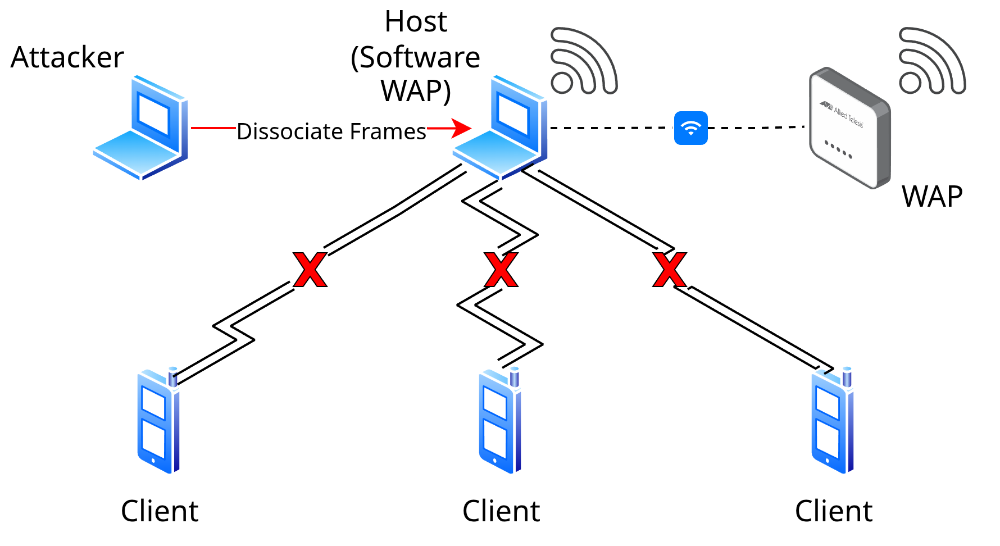

# A Software-Defined Testbed for Quantifying Deauthentication Resilience in Modern Wi-Fi Networks

Shell scripts for performing a deauthentication attack on clients connected to a
software WAP on Arch Linux. This software is not designed for attackers to
deceive wireless network users for malicious purposes such as unsolicited data
collection, and should not be used as such. For research and demonstration purposes
only.

This software is most useful for users wanting to perform analysis on Wi-Fi
deauthentication attacks in a safe and controlled environment. Typically,
setting up such an environment is time-consuming and bothersome. This
is now automated and all that is needed from the user is to follow some
basic terminal prompts.

It is recommended to utilize two Arch Linux machines for best results.
Other Linux distributions could possibly run the scripts, with the exception
of **check-packages.sh**. Support is not guaranteed for distributions not based
on Arch Linux and not using the Arch Linux official repositories with the
**pacman** package manager. It is assumed that **NetworkManager** is the network
configuration tool being utilized. For both machines, run **check-packages.sh**
and **check-hardware.sh** before continuing. Verify all required packages are
installed and the proper hardware is available.

- Machine 1: Serves as the software WAP

After verifying the packages and hardware, run **setup-wap.sh**. This script
is extensive and covers most Wi-Fi setup possibilities. You can choose
from the following security protocols: None, WEP, WPA-PSK, WPA2-PSK, WPA3-SAE.
When choosing WPA2, you have the option to enable or disable PMF. Wi-Fi standards
ranging from 802.11b/802.11a (1999) to Wi-Fi 7 802.11be (EHT) (2024) are auto-detected
and applied to the **hostapd** configuration file that is generated. You will be prompted
to enter a password for the software WAP if anything other than "None" is selected.

**NOTE**: Be familiar with the support and configuration of the WNIC and router
being utilized. The scripts try their best to auto-configure when possible
but generally do not perform exhaustive error checking and reporting to the user.
If **hostapd** or one of the other processes are not running, hardware support
for the selected security protocol is most likely the issue.

Run **cleanup.sh** once you are done and want to bring down the software WAP.

- Machine 2: Serves as the capturer and attacker

First, verify the packages and hardware, then run **capture.sh**. You will need
the BSSID and CH (channel) value of the WAP that is being captured. In another
terminal, run **attack.sh** to begin the attack on the WAP that is specified
through its BSSID.

When done, terminate execution of both scripts and run **cleanup.sh**.

---

Here is an example network topology of a Wi-Fi deauthentication attack with
the two machine setup described above:

## Required Packages

- **aircrack-ng**: Suite of tools for auditing Wi-Fi security.
- **dnsmasq**: Lightweight DHCP and DNS server.
- **hostapd**: Daemon for creating Wi-Fi access points.
- **iproute2**: Collection of utilities for managing network interfaces, routing,
  and IP configuration.
- **iw**: Command-line tool for configuring wireless interfaces.
- **macchanger**: Utility to manipulate the MAC address of a network interface.
- **mdk4**: Wireless attack tool that exploits vulnerabilities in IEEE 802.11 networks.
- **networkmanager**: System service and tools for managing network connections,
  including Wi-Fi, Ethernet, and VPNs.
- **nftables**: Framework for packet filtering, NAT, and other tasks involving
  packet management.
- **psmisc**: Miscellaneous tools for the proc file system.
- **ripgrep**: Fast regex search tool.
- **wireshark-qt**: Qt-based GUI for Wireshark, a network protocol analyzer.

## Optional Packages

- **wavemon**: Ncurses-based tool for monitoring wireless network devices.

## Scripts

The scripts should be executed in the order listed here in the appropriate machine.
All scripts except for **check-hardware.sh** need to be executed with root privileges
(sudo).

1. check-packages.sh
2. check-hardware.sh
3. setup-wap.sh
4. capture.sh
5. attack.sh
6. cleanup.sh
